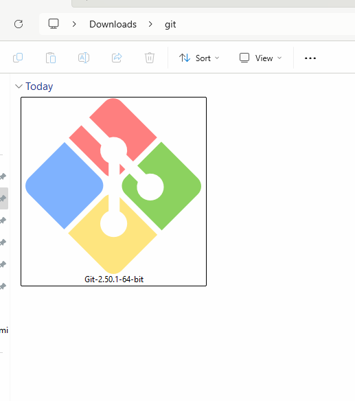
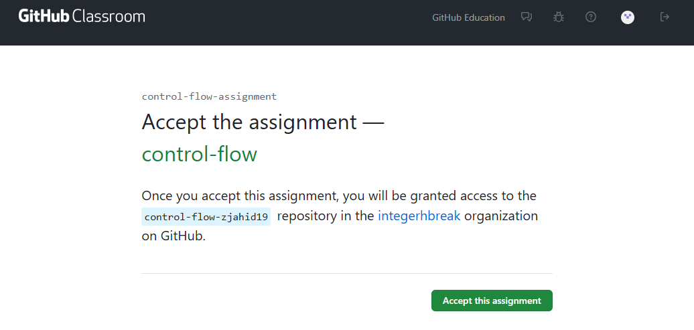
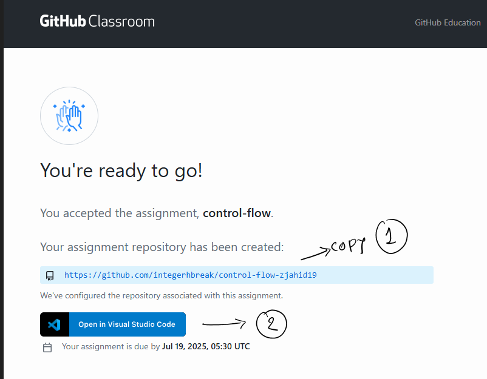
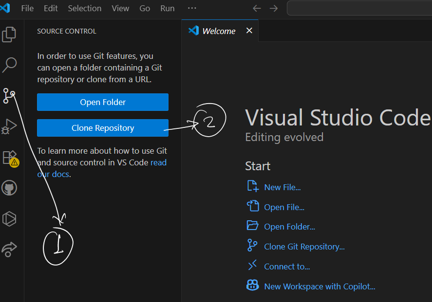
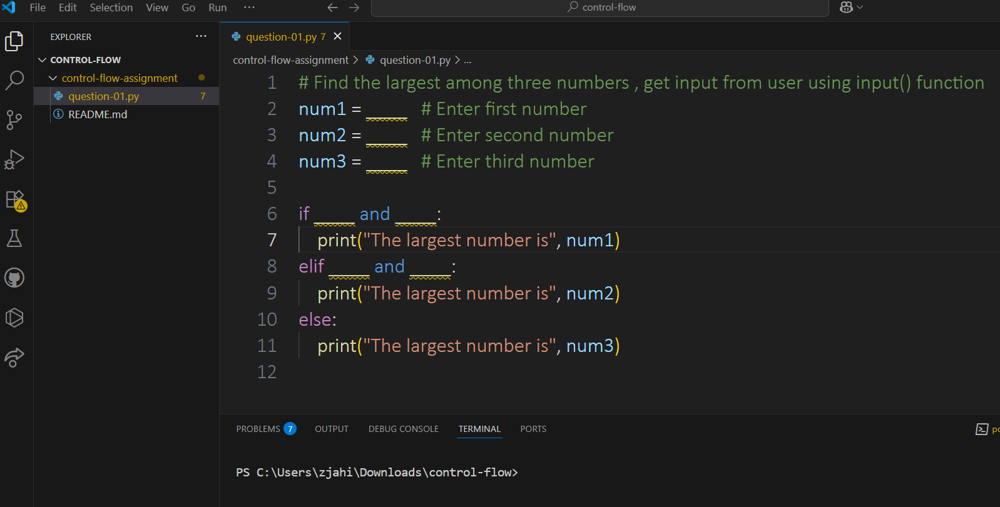
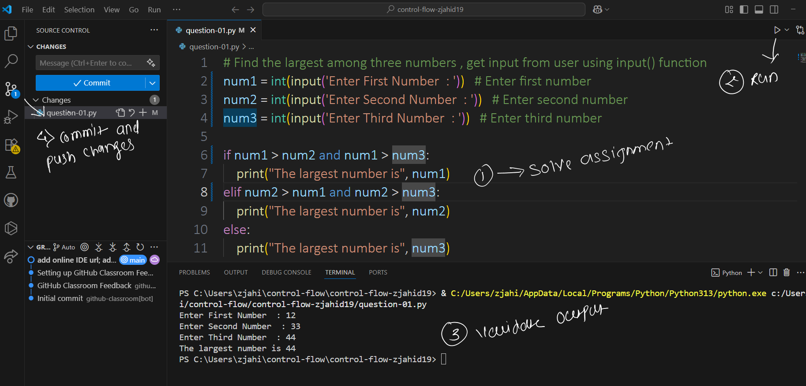
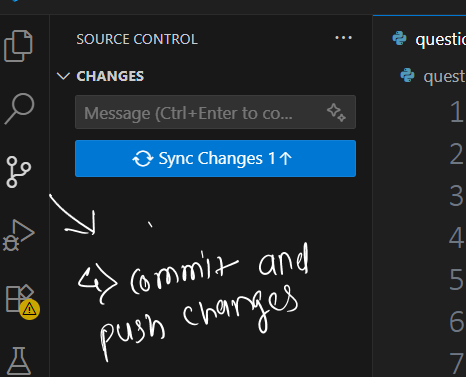

# 📖 How to Solve Assignment (GitHub Classroom)

---

## 1️⃣ Git Installation

- Visit [this link](https://git-scm.com/downloads/win) to download Git for Windows.

---

## 2️⃣ Accept Assignment

- Click on the **"Accept this assignment"** button as shown below:

---

## 3️⃣ Clone Repository

- After accepting the assignment:
  - **Step 1:** Copy the repository URL (as shown in the image).
  - **Step 2:** Click on the VS Code button.

- In VS Code:
  - **Step 1:** Click on **Clone Repository**.
  - **Step 2:** Paste copied link from above (Clone Repository - (Step-1),Enter your GitHub credentials if prompted.

- Paste the copied repository URL.
- Select a destination folder on your local machine.

---

## 4️⃣ Solve Assignment

- You will see the assignment questions as shown below:

- Make the necessary code changes, test your solution, and **commit** the changes with a proper message.

---

## 5️⃣ Push Changes to Remote Repository

- Finally, **push your changes** to GitHub as shown below:

